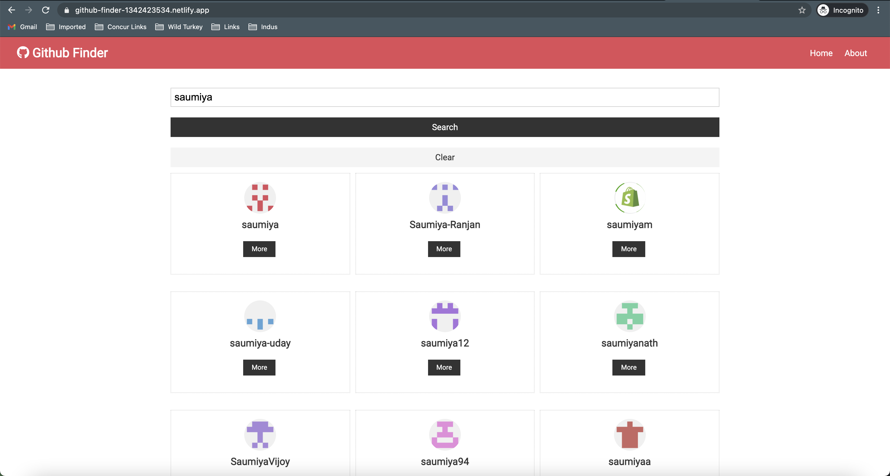
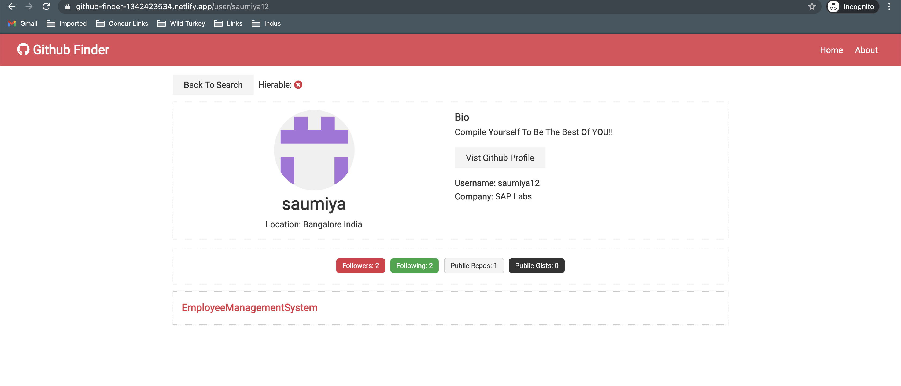

# Github Finder

This is a React app to search Github profiles.

### Steps to Run the Project to IDE:
1. In the Github repo Click on Code -> Clone -> Using https: `<copy the link>`
2. Open Terminal
3. Go to Directory you want to clone the Project
4. git clone `<paste the link copied at Step1>`
5. Go to Visual Studio Code or any IDE
6. Open or Import Project and browse the folder
7. Run the following commands to launch the project:  

`npm install`  
`npm start`  
Runs the app in the development mode.  
Open http://localhost:3000  

`npm run build`  
Builds the app for production to the build folder.  

### React:
Known as a spar framework or single page application framework.
Ie. everything is routed through a single file ie. index

### Prepare and Deploy to Netify:

Netlify builds, deploys and hosts your front-end.
A powerful serverless platform with an intuitive git-based workflow

`sudo npm i -g netlify-cli`

`netlify.toml`  
[build]  
publish = "build"   
when we run it creates a build folder that is a production build

`netlify init`
-	Give a unique name for site
-	Now project is initialized

Now go to netlify site -> open project  -> Deploy -> Deploy settings -> Environment -> edit variables

We have environment variables on server

`npm run build`  
build folder is generated

`netlify deploy –prod`

### Application deployed to Netify:
https://github-finder-1342423534.netlify.app

### Overview of application

